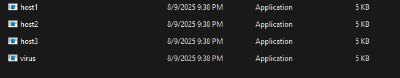
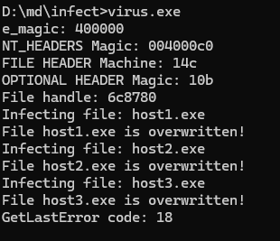
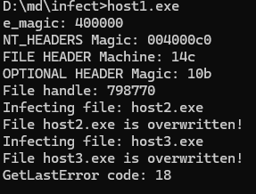
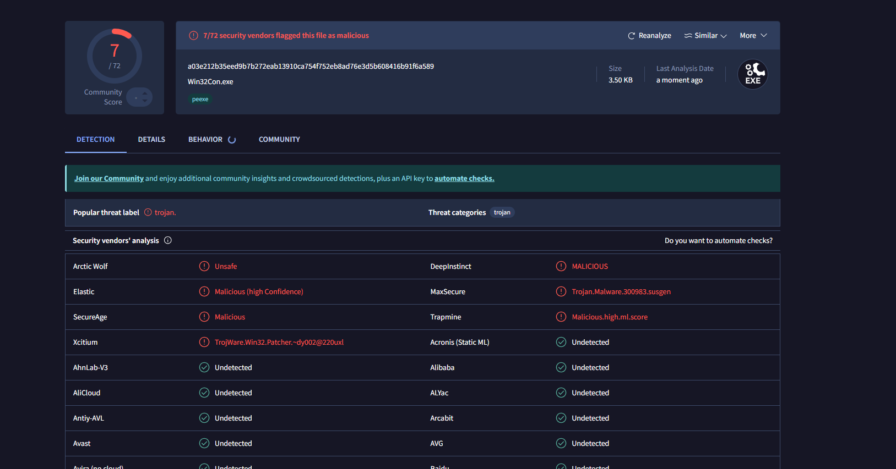

# Detailed Write-up: Self-Copying PE File Infector Virus based on Mini-51

## Overview

This program is a classic **Windows Portable Executable (PE) file infector virus** that spreads by infecting executable files within a targeted directory. It employs a self-replication strategy that circumvents common Windows file-locking restrictions by copying itself to a temporary uniquely named file before infecting host files.

---

## Key Characteristics

* **Portable Executable (PE) Infection:**
  The virus targets PE files, which include Windows executables (`.exe`) and potentially other PE-format files like DLLs. It modifies these host files by overwriting their contents with the virus code, thereby spreading the infection.

* **Self-Copying Mechanism to Avoid File Locking:**
  Windows prevents an executable from opening a write handle to its own file while it is running. To bypass this, the virus creates a copy of its executable file under a temporary filename derived from the system uptime (`GetTickCount()`). This allows the virus process to safely open and read its own code from disk via the copy.

* **Timestamp-Based Temporary Filename:**
  The temporary copy is named using the value returned by `GetTickCount()`, which provides the number of milliseconds since the system started. This ensures a unique, non-conflicting filename for the copy each time the virus runs.

* **Reading and Buffering Virus Code:**
  After creating the temporary copy, the virus opens it, reads the entire file contents into a dynamically allocated memory buffer, and then deletes the temporary file from disk. This buffer is used as the source data to overwrite other host files.

* **Directory Traversal and Host File Enumeration:**
  The virus uses Windows API functions `FindFirstFileA` and `FindNextFileA` to enumerate all target files in a specified directory. It compares each file name against its temporary copy name to avoid infecting itself.

* **Infection by Overwriting:**
  For each eligible host file found, the virus opens the file with write access and overwrites its entire content with the buffered virus code. This action replaces the host’s original code with the virus, effectively infecting the file.

* **Error Handling:**
  The virus checks return values from all critical API calls (e.g., file handles, memory allocation, read/write operations) and outputs error codes when failures occur, allowing for debugging or monitoring of the infection process.

---

lets execute the virus :)

now it has infected 3 host files lets see if the host files hass become virus or not 

boom there we go the host files have turned into an virus

## Importance of This Design

* **Bypassing File Lock Restrictions:**
  Windows file locking prevents running executables from writing to themselves. By copying itself to a new file with a unique timestamp name, the virus circumvents this, enabling safe reading and later infection.

* **Simplicity and Effectiveness:**
  The virus reads its entire binary image into memory once, then uses that buffer to infect multiple host files, minimizing repeated disk I/O.

* **Standard API Usage:**
  The virus relies on common Windows APIs, making it portable across Windows versions and straightforward to analyze or detect.

---

## Summary

This virus is a textbook example of a **self-copying PE file infector** that uses clever techniques such as timestamp-named temporary files to evade Windows file access restrictions during infection. Its methodical approach to enumerating target files and overwriting them with its own binary data exemplifies fundamental infection strategies seen in many classic Windows viruses.

